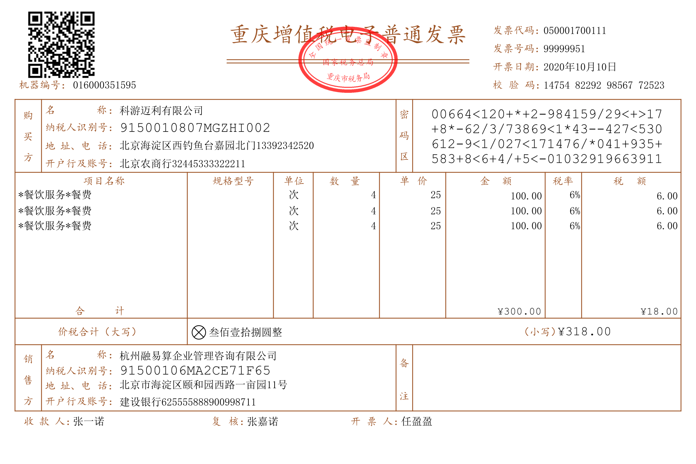
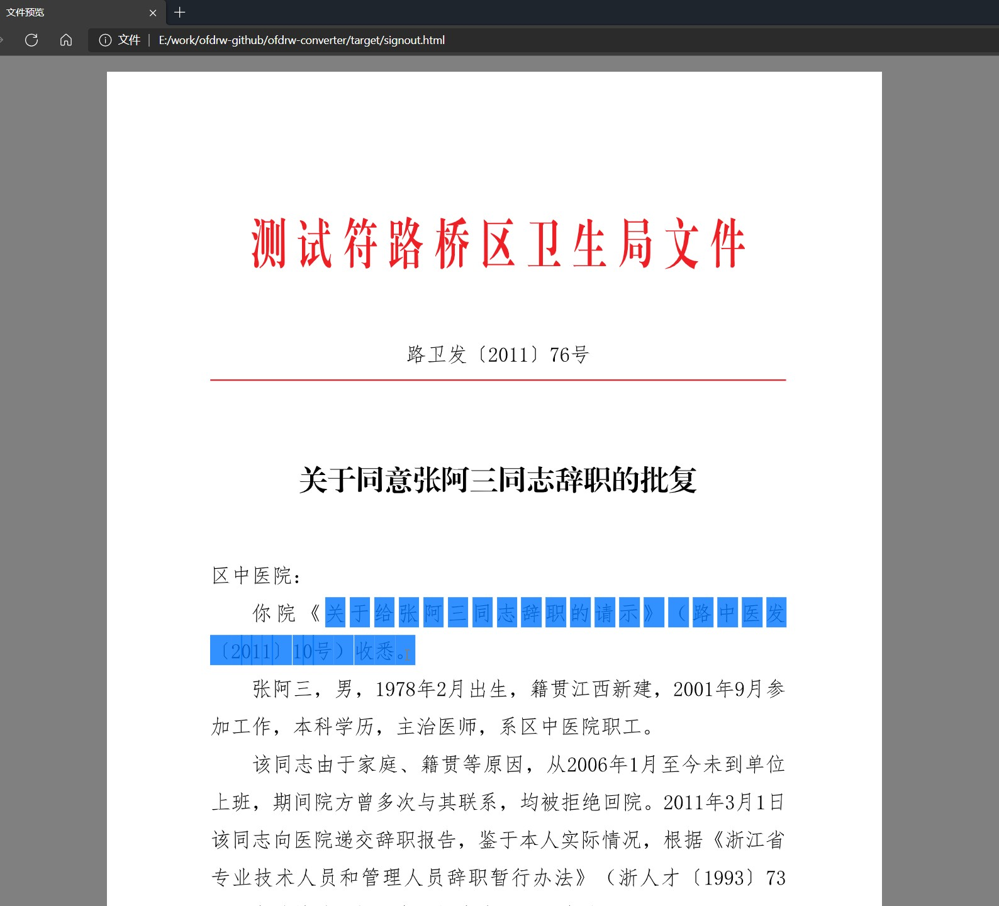

# OFD Reader & Writer 文档转换

> *致谢:*
> 
> - *[DLTech21](https://github.com/DLTech21) OFD转换PDF*
> - *[QAQtutu](https://github.com/QAQtutu) OFD转换图片、SVG。*
> - *[yuanfangme](https://github.com/yuanfangme) OFD转换HTML。*
> 
> *OFDRW社区感谢你们对convert模块的辛勤开发！*

OFDR&W文档转换支持：

- **OFD `=>` PDF**
- **OFD `=>` 图片**
- **OFD `=>` SVG(矢量图形)**
- **OFD `=>` HTML(SVG实现)**

> SVG相较于图片可以无失真的缩放。

PDF转换概述： 通过对OFD的文档进行解析，使用 Apache Pdfbox生成并转换OFD中的元素为PDF内的元素实现PDF的转换。

图片转换概述： 通过对OFD的文档进行解析，采用`java.awt`绘制图片，支持转换为`PNG`、`JPEG`图片格式。

SVG矢量图形转换概述： 使用Apache`batik-transcoder`提供的图形绘制实现`java.awt`API绘制，最终生成SVG矢量图形。

HTML转换概述： 使用上述SVG矢量图形转换作为显示效果层A，再将OFD文档中的文字（仅）解析为SVG作为文字复制层B，B置于A层之上，文字颜色transparent，无需关心字体，在移动端同样正常显示。

## Quick Start

pom引入相关模块

```xml

<dependency>
    <groupId>org.ofdrw</groupId>
    <artifactId>ofdrw-converter</artifactId>
    <version>1.10.0</version>
</dependency>
```

### 转换PDF

转换文档你需要:

1. 提供待转换OFD文档，支持Path、InputStream。
2. 提供转换后PDF文档位置。
3. 调用转换工具执行文档转换。

```java
public class HelloWorld {

    public static void main(String[] args) {
        // 1. 文件输入路径
        Path src = Paths.get("发票示例.ofd");
        // 2. 转换后文件输出位置
        Path dst = Paths.get("发票示例.pdf");
        try {
            // 3. OFD转换PDF
            ConvertHelper.toPdf(src, dst);
            System.out.println("生成文档位置: " + dst.toAbsolutePath());
        } catch (GeneralConvertException e) {
            // GeneralConvertException 类型错误表明转换过程中发生异常
            e.printStackTrace();
        }
    }
}
```

**转换得到PDF效果如图**


注意：如果OFD中的字体来自于操作系统，可能会导致转换过程中由于缺少字体导致的异常，请在部署环境的操作系统目录中加入相关字体。

### 转换图片

转换文档你需要:

1. 提供待转换OFD文档。
2. *配置字体(非必须，自定义字体目录时使用)。
3. 创建转换转换对象，并设置PPM（每毫米像素数量 Pixels per millimeter）。
4. 指定页码转换图片。
5. 存储为指定格式图片。

```java
public class HelloWorld {
    public static void main(String[] args) {
        // 1. 文件输入路径
        Path src = Paths.get("发票示例.ofd");
        // 2. 加载指定目录字体(非必须)
        // FontLoader.getInstance().scanFontDir(new File("src/test/resources/fonts"));
        // 3. 创建转换转换对象，设置 每毫米像素数量(Pixels per millimeter)
        ImageMaker imageMaker = new ImageMaker(new OFDReader(src), 15);
        for (int i = 0; i < imageMaker.pageSize(); i++) {
            // 4. 指定页码转换图片
            BufferedImage image = imageMaker.makePage(i);
            Path dist = Paths.get("target", i + ".png");
            // 5. 存储为指定格式图片
            ImageIO.write(image, "PNG", dist.toFile());
        }
    }
}
```

- [测试用例](./src/test/java/OFD2IMGTest.java) 


效果图如下：


### 转换 SVG

> SVG相较于图片可以无失真的缩放，且速度快。

转换文档你需要:

1. 提供待转换OFD文档。
2. *配置字体(非必须，自定义字体目录时使用)。
3. 创建转换转换对象，并设置PPM（每毫米像素数量 Pixels per millimeter）。
4. 指定页码转换SVG，得到SVG(XML)。
5. 存储SVG到文件。

```java
public class HelloWorld {
    public static void main(String[] args) {
        // 1. 文件输入路径
        Path src = Paths.get("发票示例.ofd");
        // 2. 加载指定目录字体(非必须)
        // FontLoader.getInstance().scanFontDir(new File("src/test/resources/fonts"));
        // 3. 创建转换转换对象，设置 每毫米像素数量(Pixels per millimeter)
        SVGMaker svgMaker = new SVGMaker(new OFDReader(src), 20);
        for (int i = 0; i < imageMaker.pageSize(); i++) {
            // 4. 指定页码转换SVG，得到SVG(XML)
            String svg = svgMaker.makePage(i);
            Path dist = Paths.get("target", i + ".svg");
            // 5. 存储到文件。
            Files.write(dist, svg.getBytes());
        }
    }
}
```

- [测试用例](./src/test/java/OFD2SVGTest.java)


效果图如下：




### 转换 HTML

> 在移动端能正常显示字体

转换文档你需要:

1. 提供待转换OFD文档。
2. *配置字体(可选)。
3. 创建转换转换对象，并设置HTML页面宽度(px)。
4. 开始转换并存储HTML到文件。

```java
public class HelloWorld {
    public static void main(String[] args) {
        //配置文字映射、文字替换规则（可选）
        FontLoader.getInstance()
            .addAliasMapping(null, "小标宋体", "方正小标宋简体", "方正小标宋简体")
            .addAliasMapping(null, "KaiTi_GB2312", "楷体", "楷体")

            .addSimilarFontReplaceRegexMapping(null, ".*Kai.*", null, "楷体")
            .addSimilarFontReplaceRegexMapping(null, ".*Kai.*", null, "楷体")
            .addSimilarFontReplaceRegexMapping(null, ".*MinionPro.*", null, "SimSun")
            .addSimilarFontReplaceRegexMapping(null, ".*SimSun.*", null, "SimSun")
            .addSimilarFontReplaceRegexMapping(null, ".*Song.*", null, "宋体")
            .addSimilarFontReplaceRegexMapping(null, ".*MinionPro.*", null, "SimSun");

        FontLoader.enableSimilarFontReplace(true);

        try {

            //开始转换OFD为HTML
            ConvertHelper.toHtml(
                new OFDReader(Paths.get("src/test/resources/n.ofd")),
                Paths.get("target/n.html").toFile().getAbsolutePath(),
                1000
            );

        } catch (GeneralConvertException | IOException e) {
            e.printStackTrace();
        }
    }
}
```

- [测试用例](./src/test/java/OFD2HTMLTest.java)


效果图如下：(蓝色为选中可复制文本)




