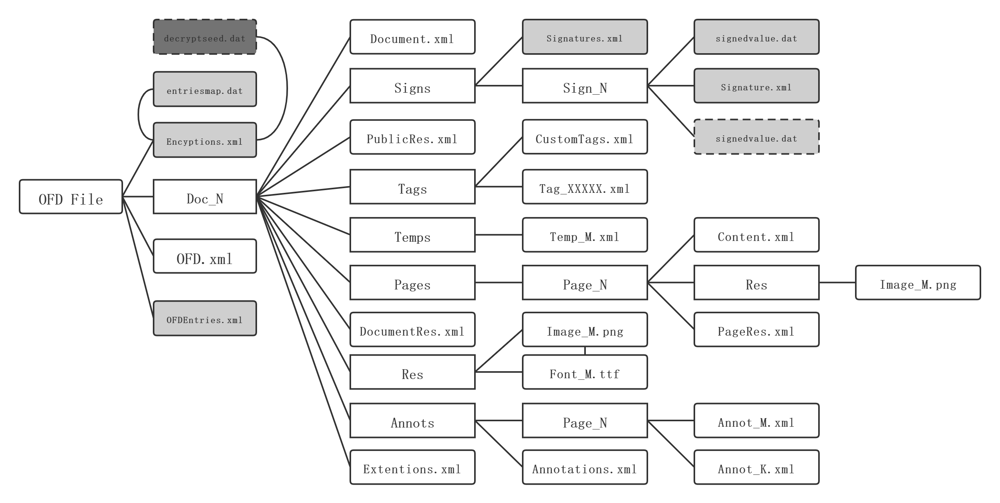

# OFD Reader & Writer 密码应用

在《GM/T 0099-2020 开放板式文档密码应用技术规范》中主要介绍了OFD的三种密码应用协议：

- OFD签名协议
- OFD加密协议：口令、证书
- OFD完整性保护协议

在《GM/T 0099-2020》文档容器为了适应上述三个协议增加定义部分结构，如下：

相较于《GBT/33190-2016》《GM/T 0099-2020》中增加了：

容器类：

- `/Doc_N/Tags/`：于存放自定义的标签。
- `/Doc_N/Temps/`：用于存放页面模板文件。
- `/Doc_N/Annots/Pages_N/`：用于存放页面注释。

文件对象：

- `/decryptseed.dat`：【XML】加密密钥描述文件，存储了方案、算法和多人、多角色、多密码或证书等关键解密信息。
- `/entriesmap.dat`：【二进制】加密后的明密文映射表，存放了明文和密文文件路径映射关系。
- `/Encryptions.xml`：解密入口文件，主要包含了2部分信息， 一部分为加密概要信息，另一部分为密钥描述文件和明文映射表的位置。
- `/OFDEntries.xml`：完整性描述文件，描述支撑文件完整性的包内文件列表、签名方案、保存的签名值等内容。
- `/Doc_N/Extentions.xml`：（标准中没有明确提及作用，推测为扩展使用）

## OFD签名协议

签名验签协议，除了几个扩展的字段外与《GB/T 22190-2016》第18章中基本一致。

《GM/T 0099-2020》7.2.2 数据格式要求，针对于签名操作产生的签名数据结构要求如下：

- 签名类型为电子签章时，签名值数据应遵循《GB/T 38540-2020》;
- 签名类型为数字签名且签名算法使用SM2时，签名值数据应遵循《GB/T 35275》；
- 签名类型为数字签名且签名算法为其他时，签名值数据应遵循该算法对应的数据值规范。

关于签名验签流程更多资料请见 [《OFD Reader & Writer 数字签名》](../ofdrw-sign/README.md)

## OFD加密协议

### 概述

《GM/T0099-2020》 C.1 总体说明：

“OFD采用‘xml+zip’的格式架构，文档的呈现内容由zip包内的多个文件共同决定，这些文件的划分可以细分到图层和单次修改操作。基于这些特征，可根据需要对不同的包内文件进行加密，实现文档局部或整体的加密功能。”

官方给出了几种加密的例子：

- 只对特定页（Page_N）的所有内容加密，则可将Page_N对应的模板文件、页面内容文件和注释文件及其对应的资源文件列入待加密的范围；
- 只对特定页面的注释内容进行加密，则可将该页的注释文件及资源文件列入待加密范围该页对应模板文件和内容文件则维持不变。

“包内文件加密后，原有的明文文件应删除或更换为非保密内容，并记录密文解密后的替换关系。在文件解密端约定按照原有逻辑进行解析，并约定一旦在替换关系中存在记录，解密端需使用密件解密后的内容取代对应明文。”

“在这种约定下，可以实现同一密件文档在不同的解密条件下呈现不同的内容。”

在《GM/T0099-2020》中OFD支持两种加密方式：

- 口令加密
- 证书加密

两种加密方式，并非用于加密OFD包内的文件，他们都是用于加密”文件加密密钥“。

OFD包内的文件采用“文件加密密钥”进行加密，目前标准中只支持 **SM4,CBC模式** 对包内文件加密。

SM4分组长度为16字节，IV向量长度：16字节，密钥长度：16字节，填充方式采用 PKCS#7

### 加密流程

通过密码服务模块中的随机数发生器，产生随机数作为产生 **文件加密对称密钥（16Byte）** 和 CBC加密模式所需要的 **IV向量（16Byte）**。

- **文件加密对称密钥**：16字节随机数，用于文件的加解密，将会被加密存储于密钥描述文件内。
- **IV向量**：16字节随机数，用于文件的加解密的初始化IV向量，将会明文储于密钥描述文件内。

在OFD包内选出待加密的文件，使用 **文件加密对称密钥** 加密（SM4,CBC模式）文件，加密后删除原文件，保存加密后的文件，
并在 **明密文映射表** 中增加一条记录。由于明密文映射表的存在，加密后的文件路径可以存放于任意位置。流程示例如下：

上图中，我们选择`/Doc_0/Pages/Page_0/Content.xml`作为待加密文件，通过上一步生成的IV向量
和对称密钥，使用加密引擎对文件进行了加密，并把密文存储在`/enc/a.dat`，删除了原文件。
同时还向明密文映射表中增加一条映射记录，用于基于加密前后文件的关系。如果还有其它待加密文件，
那么就重复上面流程。

明密文映射表（`EncyptEntries.xml`）采用XML描述，由于该表保存了映射表关系，一定程度上
也会泄露加密内容该表也需要被加密。

明密文映射表会在 **最后** 被加密，加密的流程同普通文件加密一致，特殊的加密后的明密文映射表，
以`entriesmap.dat`保存于，OFD包的根路径下。如下图所示：

