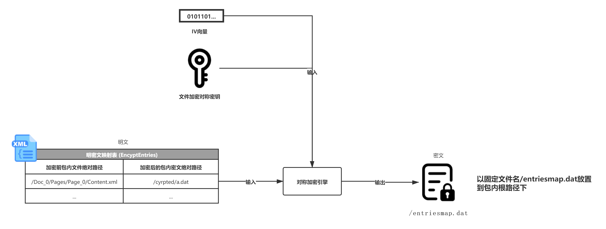
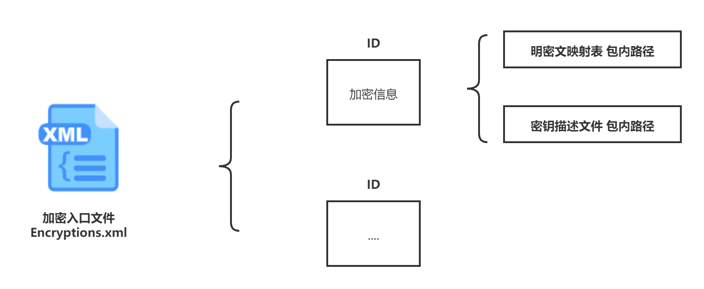
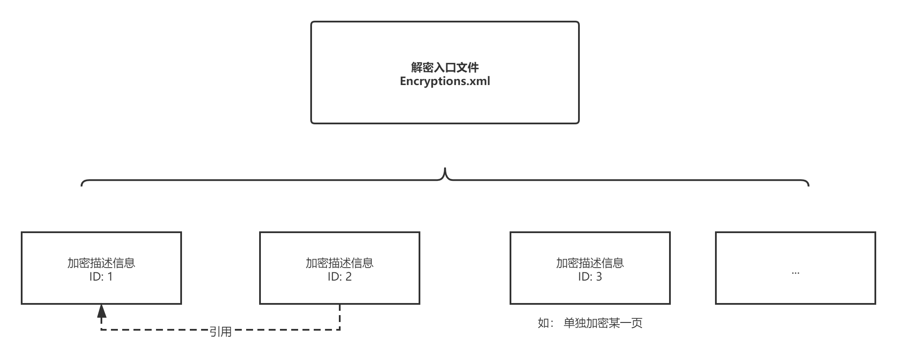
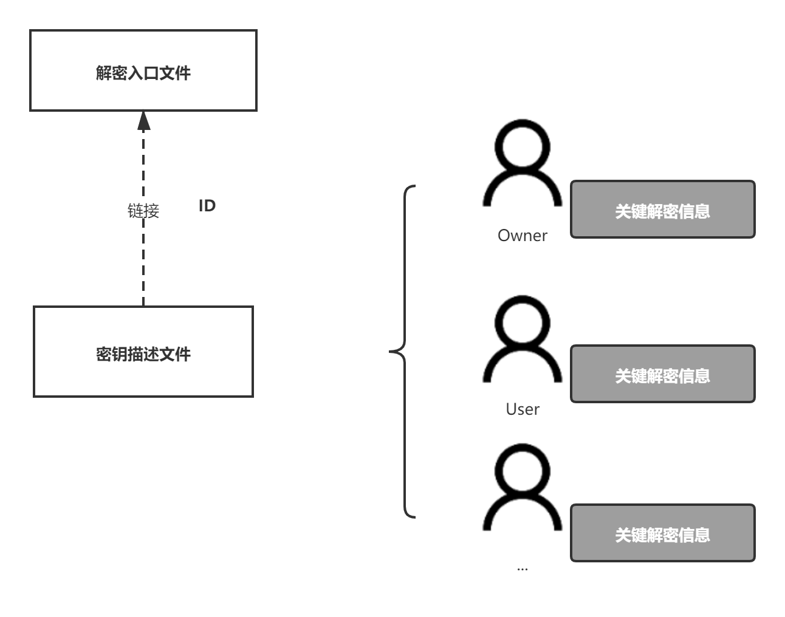
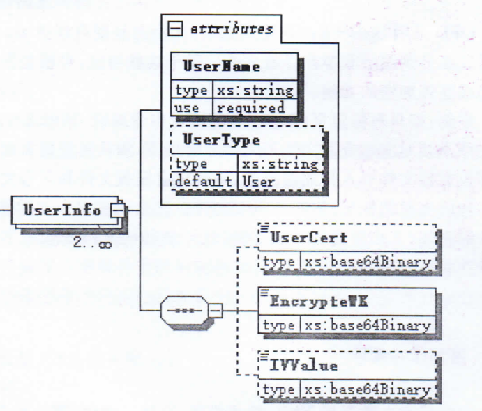
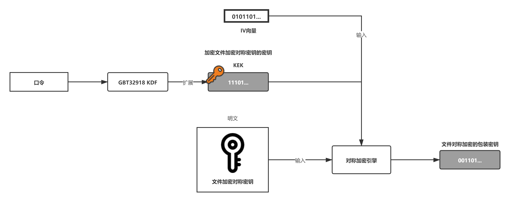

# OFD加密协议

## 概述

《GM/T0099-2020》 C.1 总体说明：

“OFD采用‘xml+zip’的格式架构，文档的呈现内容由zip包内的多个文件共同决定，这些文件的划分可以细分到图层和单次修改操作。基于这些特征，可根据需要对不同的包内文件进行加密，实现文档局部或整体的加密功能。”

官方给出了几种加密的例子：

- 只对特定页（Page_N）的所有内容加密，则可将Page_N对应的模板文件、页面内容文件和注释文件及其对应的资源文件列入待加密的范围；
- 只对特定页面的注释内容进行加密，则可将该页的注释文件及资源文件列入待加密范围该页对应模板文件和内容文件则维持不变。

“包内文件加密后，原有的明文文件应删除或更换为非保密内容，并记录密文解密后的替换关系。在文件解密端约定按照原有逻辑进行解析，并约定一旦在替换关系中存在记录，解密端需使用密件解密后的内容取代对应明文。”

“在这种约定下，可以实现同一密件文档在不同的解密条件下呈现不同的内容。”

在《GM/T0099-2020》中OFD支持两种加密方式：

- 口令加密
- 证书加密

两种加密方式，并非用于加密OFD包内的文件，他们都是用于加密”文件加密密钥“。

OFD包内的文件采用“文件加密密钥”进行加密，目前标准中只支持 **SM4,CBC模式** 对包内文件加密。

SM4分组长度为16字节，IV向量长度：16字节，密钥长度：16字节，填充方式采用 PKCS#7

## 加密流程

《GM/T0099-2020》 7.3.4加密流程 原文如下：

根据加密方案进行文件加密。流程如下：

- a) 生成用于ZIP包内文件加密的对称密钥；
- b) 根据加密方案，使用步骤 a)生成的文件加密对称密钥调用对称密码算法加密包内文件并写入ZIP包内；
- c) 根据加密方案，对已经生成密文的明文文件进行处理，部分写入ZIP包内；
- d) 组装名密文映射表文件，根据加密方案对其进行加密后或直接写入ZIP包内；
- e) 组装加密入口文件，明文写入ZIP包内；
- f) 根据加密方案，对文件加密对称密钥进行密钥包装或非对称加密生成文件对称加密的包装密钥；
- g) 如果电子文件访问者为多人，则重复7.3.4的步骤 e)；
- h) 组装密钥描述文件，并写入ZIP包。

### 加密流程详解

通过密码服务模块中的随机数发生器，产生随机数作为产生 **文件加密对称密钥（16Byte）** 和 CBC加密模式所需要的 **IV向量（16Byte）**。

- **文件加密对称密钥**：16字节随机数，用于文件的加解密，将会被加密存储于密钥描述文件内。
- **IV向量**：16字节随机数，用于文件的加解密的初始化IV向量，将会明文储于密钥描述文件内。

在OFD包内选出待加密的文件，使用 **文件加密对称密钥** 加密（SM4,CBC模式）文件，加密后删除原文件，保存加密后的文件，
并在 **明密文映射表** 中增加一条记录。由于明密文映射表的存在，加密后的文件路径可以存放于任意位置。流程示例如下：

上图中，我们选择`/Doc_0/Pages/Page_0/Content.xml`作为待加密文件，通过上一步生成的IV向量
和对称密钥，使用加密引擎对文件进行了加密，并把密文存储在`/enc/a.dat`，删除了原文件。
同时还向明密文映射表中增加一条映射记录，用于基于加密前后文件的关系。如果还有其它待加密文件，
那么就重复上面流程。

明密文映射表（`EncyptEntries.xml`）采用XML描述，由于该表保存了映射表关系，一定程度上
也会泄露加密内容该表也需要被加密。

明密文映射表会在 **最后** 被加密，加密的流程同普通文件加密一致，特殊的加密后的明密文映射表，
以`entriesmap.dat`保存于，OFD包的根路径下。如下图所示：

完成加密明密文映射表的加密后，组装 **解密入口文件** ，加密入口文件采用XML表示。

每个OFD文件仅有一个 **解密入口文件**，加密入口文件内可以包含多个加密信息（`EncryptInfo`）。

每个加密信息包含两部分内容：加密概要信息、密钥描述文件和明密文映射表的位置。

在生成解密入口文件时，**密钥描述文件** 尚未生成，因此需要在解密入口文件中预置好 **密钥描述文件** 位置。

每个密钥信息（`EncryptInfo`）都有自己独立的ID，加密信息间可以通过ID相互引用串联起来，形成多重加密。

接下需要根据加密方案对 **文件加密对称密钥** 进行包装，目前支持口令、证书两种方案。

密钥描述文件的生成在《加密方案》章节中详解，此处只需要了解即可。

加密方案对密钥包装后生成 **密钥描述文件**，密钥描述文件采用XML格式描述，存储了方案、算法和多人、多角色、
多密码或证书等关键解密信息。

如果待加密文件的访问者为多人，那么多人需要根据各自使用的加密方案生成密钥信息（`EncryptInfo`）,
并写入**密钥描述文件**。

最终**密钥描述文件** 以文件名`decryptseed.dat`明文存储于OFD包的根路径下，即：`/decryptseed.dat`
多重加密会有多个 **密钥描述文件**，多重加密的文件命名规则在标准中没有提及，可以参考`_N`方式命名。

最终把上述所有内容打包ZIP压缩形成加密后的OFD文件。

## 加密方案

加密方案加密的对象为“文件加密对称密钥”，根据加密的方式可分为：

- 口令加密方案
- 证书加密方案

它们通过唯一的加密方案标识来区别，加密方案标识符见《GM/T0099-2020》 附录 A.1

两种方案结果将在密钥描述文件生成用户信息（UserInfo）节点，节点结构如下：

### 口令加密方案

通过用户输入的口令，采用《GB/T 32918》的密钥派生函数生成 **加密文件加密对称密钥的密钥**（简称：`FKEK` File Key Encrypt Key）。

然后采用对称算法，使用上步骤得到的`FKEK`和IV向量，对“文件加密对称密钥”进行加密。

加密后的“文件加密对称密钥”、IV，结合上加密用户的身份信息一起组成 用户信息（UserInfo），放入 密钥描述文件内。

### 证书加密方案

证书加密，也就是由加密者提供数字证书，从数字证书中取得用户的公钥，采用非对称密码算法，
使用公钥对 “文件加密对称密钥”进行加密。

加密后的“文件加密对称密钥”、数字证书，结合上加密用户的身份信息一起组成 用户信息（UserInfo），放入 密钥描述文件内。
